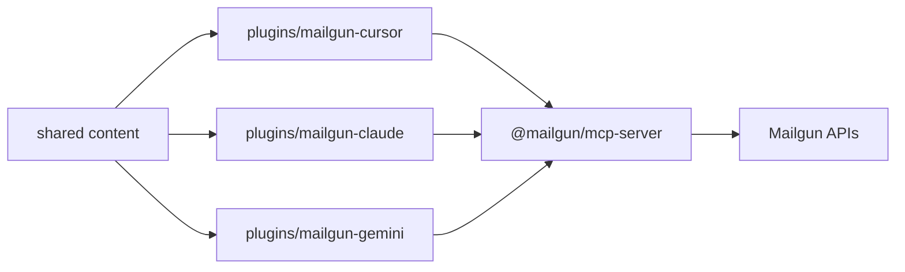

# Architecture

Mailgun Plugins is intentionally a packaging repository. It keeps Mailgun API behavior in `mailgun-mcp-server` and focuses this repo on platform distribution.

## Layers

| Layer | Location | Responsibility |
| --- | --- | --- |
| Execution | `@mailgun/mcp-server` | Registers Mailgun MCP tools and calls Mailgun APIs. |
| Shared content | `shared/` | Canonical skills, rules, prompts, setup docs, and examples. |
| Platform packages | `plugins/mailgun-*` | Manifests, MCP config, commands, generated skills/rules. |
| Validation | `scripts/` and `.github/workflows/` | Manifest checks, sync checks, required file checks, MCP version pin checks. |

## Dependency Direction

The platform packages depend on the published MCP package. They do not copy API clients, OpenAPI specs, endpoint lists, or business logic from the MCP server.



## Shared Content Sync

`shared/skills` is copied into every platform package. `shared/rules` is copied into Cursor and Claude packages. Commands are authored by platform because command formats differ:

- Cursor and Claude use Markdown command files.
- Gemini uses TOML command files.

Run `npm run sync` after editing shared content. CI runs `npm run check:sync` so generated platform copies cannot drift silently.

## Gemini Distribution

Gemini CLI expects `gemini-extension.json` at the extension repository root. Because this repository also hosts Cursor and Claude marketplace roots, Gemini source remains under `plugins/mailgun-gemini` and `npm run build:gemini` creates a Gemini extension artifact at `dist/gemini/mailgun-gemini`.

The `Publish Gemini Extension Branch` GitHub Actions workflow publishes that artifact to the `gemini-extension` branch for public installation.

## MCP Startup

Default startup uses:

```bash
npx -y @mailgun/mcp-server@2.1.0
```

This gives each platform a predictable MCP dependency with a fixed version. Packaged configs require only `MAILGUN_API_KEY`; the MCP server defaults to the US region and all tags when `MAILGUN_API_REGION` and `MAILGUN_MCP_TAGS` are omitted. Local development can override the command to a built checkout of `mailgun-mcp-server` without changing plugin content.

## Safety Model

The MCP server exposes a curated tool surface. The plugin adds agent guidance:

- diagnostics before account changes,
- explicit confirmation before sending or mutating,
- narrow tool scoping through `MAILGUN_MCP_TAGS`,
- sensitivity handling for recipients, logs, stored messages, templates, webhook payloads, and API keys.
